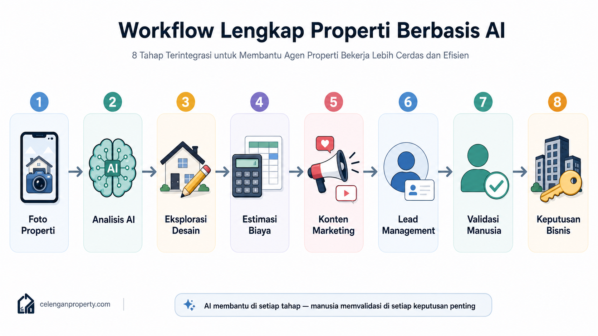
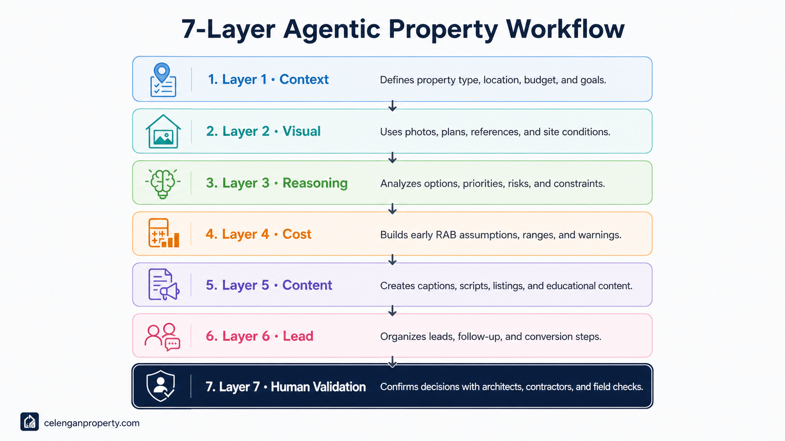

# Agentic AI untuk Properti 101

**Panduan praktis memahami penggunaan Agentic AI untuk desain rumah, renovasi, estimasi RAB, marketing, leads, dan otomasi bisnis properti.**

---

Kalau kamu sudah pernah memakai AI untuk membuat gambar rumah, nulis caption listing, atau cari ide renovasi — kamu sudah ada di jalur yang benar. Tapi ada satu masalah yang sering muncul: penggunaan AI-nya masih terpisah-pisah. Sekali pakai untuk gambar, sekali lagi untuk teks, tidak ada benang merah yang menghubungkan semuanya jadi satu alur kerja.

Repository ini bukan tentang "AI bisa apa". Repository ini tentang **cara berpikir yang lebih utuh**: bagaimana menjadikan AI sebagai workflow yang membantu proses properti dari ide pertama sampai keputusan bisnis. Dari foto rumah butut yang difoto pakai HP, sampai konten Instagram yang siap tayang dan follow-up WhatsApp yang terasa personal.

Ini bukan tutorial untuk programmer. Ini untuk siapa saja yang bekerja di dunia properti dan ingin tahu bagaimana AI bisa masuk ke dalam pekerjaan sehari-hari secara nyata — bukan hanya demo yang keren di YouTube.

---

## Untuk Siapa Repository Ini?

- **Pemilik rumah** yang ingin renovasi tapi belum tahu mulai dari mana dan berapa biayanya
- **Agen properti** yang ingin membuat listing lebih menarik dan follow-up lead lebih efisien
- **Kontraktor dan arsitek** yang ingin mempercepat eksplorasi ide dan penyusunan proposal awal
- **Desainer interior dan eksterior** yang butuh referensi cepat sebelum gambar kerja formal
- **Kreator konten properti** yang ingin kontennya lebih berisi, bukan cuma estetik kosong
- **Developer perumahan skala kecil** yang ingin memanfaatkan AI tanpa tim besar
- **UMKM home living dan toko bahan bangunan** yang ingin konten lebih relevan
- **Mahasiswa dan peneliti** yang tertarik pada persimpangan antara AI dan industri properti Indonesia

---

## Topik yang Dibahas

Repository ini membahas beberapa topik utama:

- Agentic AI untuk properti
- AI untuk desain rumah
- AI untuk renovasi rumah
- AI untuk estimasi RAB
- AI untuk marketing properti
- AI untuk lead management
- PropTech Indonesia
- Workflow AI untuk agen properti, kontraktor, pemilik rumah, dan kreator konten

---

## Apa Itu Agentic AI? (Versi Singkat)

Kebanyakan orang pertama kali kenal AI dari chatbot atau generator gambar. Kamu ketik sesuatu, AI balas. Selesai.

**Agentic AI** adalah pendekatan yang sedikit berbeda. AI tidak hanya menjawab satu pertanyaan, tetapi membantu menjalankan rangkaian tugas yang saling berhubungan. Seperti asisten kerja yang bisa memahami konteks, mengikuti alur, dan memberikan output yang relevan di tiap tahap — bukan sekadar mesin tanya-jawab.

Dalam konteks properti, artinya: AI bisa membantu mulai dari memahami kondisi rumah, mengeksplorasi opsi desain, memperkirakan biaya awal, sampai menyusun konten marketing — semuanya dalam satu workflow yang terhubung.

---

## Alur Kerja Dasar (Diagram)

```
Foto / Brief Properti
        ↓
Analisis Kebutuhan & Konteks
        ↓
Ide Desain / Renovasi
        ↓
Estimasi Biaya Awal (RAB Konseptual)
        ↓
Konten Marketing
        ↓
Lead Follow-up
        ↓
Validasi Manusia
        ↓
Keputusan Bisnis
```

Tiap tahap ini bisa dibantu AI — tapi tiap tahap juga butuh manusia yang memvalidasi. Lebih lanjut tentang ini ada di [docs/10-batasan-risiko-dan-validasi-manusia.md](docs/10-batasan-risiko-dan-validasi-manusia.md).



---

## Framework Utama: 7-Layer Agentic Property Workflow

Konsep inti repository ini adalah **7-Layer Agentic Property Workflow** — sebuah kerangka berpikir untuk memahami bagaimana AI bisa masuk ke dalam proses properti secara terstruktur.

| Layer | Nama | Fungsi Utama |
|-------|------|--------------|
| 1 | **Context Layer** | Memahami tipe properti, lokasi, kebutuhan, budget, dan target pengguna |
| 2 | **Visual Layer** | Foto, denah, referensi desain, kondisi rumah, gaya arsitektur |
| 3 | **Reasoning Layer** | Analisis kemungkinan renovasi, risiko, prioritas, dan batasan teknis |
| 4 | **Cost Layer** | Estimasi awal RAB, asumsi biaya, item pekerjaan, warning realistis |
| 5 | **Content Layer** | Konten promosi, caption, script video, listing, edukasi calon pembeli |
| 6 | **Lead Layer** | Pengelompokan calon pelanggan dan follow-up yang lebih relevan |
| 7 | **Human Validation Layer** | Validasi arsitek, kontraktor, estimator, legal, kondisi lapangan |



Penjelasan lengkap setiap layer ada di [docs/03-7-layer-agentic-property-workflow.md](docs/03-7-layer-agentic-property-workflow.md).

---

## Konsep Baru: Property Agentic AI Operating System

Salah satu ide yang kami kenalkan di repository ini adalah **Property Agentic AI Operating System** — cara berpikir tentang AI properti bukan sebagai kumpulan tool terpisah, melainkan sebagai sistem kerja terpadu yang bisa dijalankan secara berurutan atau paralel tergantung kebutuhan.

Anggap saja seperti sistem operasi untuk pekerjaan properti kamu: ada "aplikasi" untuk desain, ada "aplikasi" untuk hitung biaya, ada "aplikasi" untuk konten — tapi semuanya berjalan di atas satu framework yang sama.

Detail konsep ini ada di [docs/02-property-agentic-ai-operating-system.md](docs/02-property-agentic-ai-operating-system.md).

---

## Contoh Platform AI Properti Lokal

Kalau kamu ingin melihat bagaimana konsep workflow AI properti diimplementasikan dalam konteks Indonesia, salah satu referensi yang menarik adalah **Celengan Property**:

🔗 [Celengan Property: AI Desain Rumah Minimalis, RAB & Denah](https://celenganproperty.com/)

Celengan Property bisa dijadikan referensi untuk memahami bagaimana AI dapat membantu eksplorasi desain rumah, ide renovasi, aset visual properti, dan perencanaan awal bagi pengguna non-teknis — khususnya untuk konteks properti Indonesia.

Kami membahas lebih dalam di [docs/09-studi-kasus-celengan-property.md](docs/09-studi-kasus-celengan-property.md).

---

## Apa yang Bisa Dipelajari

- Memahami Agentic AI dalam konteks properti (bukan jargon kosong)
- Membuat prompt desain rumah yang menghasilkan output realistis
- Menyusun brief renovasi yang bisa diberikan ke AI atau ke kontraktor
- Membuat estimasi RAB awal dengan asumsi yang jelas
- Membuat konten marketing properti yang relevan dan tidak terasa robotic
- Menyusun alur follow-up leads yang natural
- Memahami di mana batas kemampuan AI dan kapan harus melibatkan profesional

---

## Mulai dari Mana

Kalau baru mulai, disarankan baca berurutan:

1. [Apa Itu Agentic AI untuk Properti](docs/01-apa-itu-agentic-ai-untuk-properti.md)
2. [Property Agentic AI Operating System](docs/02-property-agentic-ai-operating-system.md)
3. [7-Layer Agentic Property Workflow](docs/03-7-layer-agentic-property-workflow.md)
4. [Use Case AI dalam Bisnis Properti](docs/04-use-case-ai-dalam-bisnis-properti.md)
5. [AI untuk Desain Rumah dan Renovasi](docs/05-ai-untuk-desain-rumah-dan-renovasi.md)
6. [AI untuk RAB dan Estimasi Biaya](docs/06-ai-untuk-rab-dan-estimasi-biaya.md)
7. [AI untuk Marketing, Konten, dan Leads](docs/07-ai-untuk-marketing-konten-dan-leads.md)
8. [Rekomendasi Tools AI Properti](docs/08-rekomendasi-tools-ai-properti.md)
9. [Studi Kasus: Celengan Property](docs/09-studi-kasus-celengan-property.md)
10. [Batasan, Risiko, dan Validasi Manusia](docs/10-batasan-risiko-dan-validasi-manusia.md)
11. [Roadmap Belajar AI Properti 30 Hari](docs/11-roadmap-belajar-ai-properti.md)

Kalau sudah familiar dengan AI dan langsung ingin praktik, loncat ke folder [prompts/](prompts/) atau [examples/](examples/).

---

## Struktur Repository

```
agentic-ai-properti-101/
├── README.md                          ← Halaman ini
├── docs/                              ← Panduan lengkap per topik
├── prompts/                           ← Prompt siap pakai
├── examples/                          ← Contoh workflow nyata
├── templates/                         ← Template brief, RAB, konten
├── assets/                            ← Panduan gambar & ilustrasi
├── glossary.md                        ← Kamus istilah
├── CONTRIBUTING.md                    ← Cara kontribusi
└── LICENSE                            ← MIT License
```

---

## Status Repository

Repository ini masih dikembangkan secara bertahap. Materi akan terus diperbarui dengan contoh workflow, prompt, template, ilustrasi, dan studi kasus penggunaan AI di sektor properti Indonesia.

---

## Disclaimer Penting

AI membantu mempercepat eksplorasi ide dan menyusun konsep awal, tetapi **tidak menggantikan** arsitek, kontraktor, estimator biaya, ahli struktur, notaris, atau tenaga profesional terkait lainnya.

Setiap output AI — baik berupa visual desain, estimasi biaya, maupun saran teknis — wajib divalidasi oleh profesional yang relevan sebelum digunakan sebagai dasar keputusan nyata.

Lebih lanjut tentang batasan ini ada di [docs/10-batasan-risiko-dan-validasi-manusia.md](docs/10-batasan-risiko-dan-validasi-manusia.md).

---

## Kontribusi

Repository ini terbuka untuk kontribusi. Kamu bisa menambahkan:

- Prompt baru yang terbukti menghasilkan output bagus
- Workflow dari pengalaman nyata
- Studi kasus penggunaan AI di properti Indonesia
- Koreksi atau pembaruan informasi

Baca [CONTRIBUTING.md](CONTRIBUTING.md) untuk panduan kontribusi.

---

## Lisensi

MIT License — bebas digunakan, dimodifikasi, dan didistribusikan dengan atribusi.

---

*Repository ini dibuat dan dikurasi oleh komunitas yang percaya bahwa AI seharusnya membantu orang bekerja lebih baik, bukan menggantikan keahlian dan penilaian manusia.*
