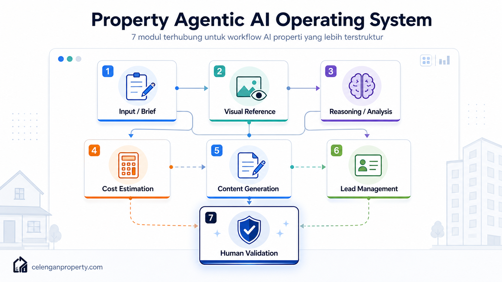

# 02 — Property Agentic AI Operating System

*Sebuah cara berpikir baru tentang AI properti: bukan sebagai kumpulan tools, tetapi sebagai sistem kerja terpadu.*

---

## Mengapa Kita Butuh Cara Berpikir Baru

Sebelum ada sistem operasi komputer, orang harus menulis program langsung ke hardware. Setiap program berdiri sendiri, tidak bisa saling berbagi data dengan mudah, dan setiap kali butuh sesuatu yang baru, harus mulai dari nol lagi.

Sistem operasi mengubah itu: ia menyediakan lapisan tengah yang memungkinkan berbagai aplikasi berjalan di atas satu platform yang sama, saling berbagi sumber daya, dan punya cara kerja yang konsisten.

**Property Agentic AI Operating System** adalah analogi yang sama untuk penggunaan AI di industri properti.

Bukan tentang "pakai ChatGPT untuk ini, Midjourney untuk itu, lalu Google Sheets untuk yang lain" — melainkan tentang membangun cara berpikir yang menyatukan semua proses itu dalam satu alur yang masuk akal.

---

## Apa Itu Property Agentic AI Operating System?

**Definisi kerja:**

> Property Agentic AI Operating System adalah kerangka kerja yang mengintegrasikan berbagai kemampuan AI — visual, bahasa, penalaran, dan data — ke dalam alur kerja properti yang terstruktur, dari input awal hingga keputusan bisnis, dengan melibatkan validasi manusia di titik-titik kritis.

Tiga kata kunci di sini:
- **Terintegrasi** — output satu tahap menjadi input tahap berikutnya
- **Terstruktur** — ada urutan yang logis, bukan random
- **Validasi manusia** — AI bukan pengambil keputusan, manusia tetap di kendali

---

## Komponen Sistem

### Komponen 1: Input / Brief

Titik masuk sistem. Semua yang perlu diketahui AI untuk bisa bekerja dengan konteks yang tepat:

- Tipe properti (rumah tinggal, ruko, apartemen, rumah subsidi, dll.)
- Lokasi dan iklim (panas-kering, tropis basah, pegunungan, pesisir)
- Kondisi saat ini (baru beli, mau renovasi, masih cicilan)
- Tujuan (ditempati sendiri, disewakan, dijual, dikontrakkan)
- Budget: range yang realistis, bukan wishlist
- Batasan: apa yang tidak boleh diubah (struktur, posisi sumur, akses jalan)
- Siapa penggunanya: keluarga muda, lansia, pasangan, kost mahasiswa

Semakin lengkap brief, semakin relevan output AI di semua tahap berikutnya.

### Komponen 2: Visual Reference

Input berupa gambar yang membantu AI memahami kondisi nyata:

- Foto kondisi eksisting rumah (luar dan dalam)
- Denah atau sketsa kasar
- Foto referensi gaya yang diinginkan
- Kondisi lingkungan sekitar (penting untuk fasad dan orientasi)
- Material eksisting yang terlihat

Foto jelek tetap lebih berguna dari tidak ada foto. AI modern bisa membaca banyak informasi dari foto kamar HP sekalipun.

### Komponen 3: Reasoning (Analisis)

Ini "otak" sistem. AI membantu menganalisis:

- Apa yang realistis dilakukan dalam budget yang ada
- Apa risiko teknis yang perlu diperhatikan
- Urutan prioritas pengerjaan yang masuk akal
- Kemungkinan masalah yang sering terjadi di tipe properti ini
- Pertanyaan yang perlu dijawab sebelum lanjut

Komponen ini bukan untuk menggantikan arsitek atau kontraktor, tapi untuk membantu klien atau pemilik rumah sampai di level pemahaman yang lebih baik sebelum konsultasi teknis.

### Komponen 4: Cost Estimation (Estimasi Biaya)

Output berupa angka kasar yang bisa dijadikan titik awal diskusi:

- Item pekerjaan utama
- Range harga per item (bukan angka tunggal yang menyesatkan)
- Asumsi yang dipakai (kualitas material, upah daerah, dll.)
- Warning untuk hal-hal yang bisa membuat biaya melonjak
- Rekomendasi untuk validasi lanjutan

Penting: ini bukan RAB teknis. Ini adalah RAB konseptual yang membantu mengukur apakah ide awal masuk akal secara finansial.

### Komponen 5: Content Generation

Output berupa materi komunikasi:

- Deskripsi properti untuk listing
- Caption media sosial
- Script video pendek
- Konten edukasi untuk calon pembeli
- FAQ yang bisa diantisipasi

Komponen ini sangat membantu agen, kontraktor, atau developer yang harus rutin memproduksi konten.

### Komponen 6: Lead Management

AI membantu mengorganisir dan memprioritaskan calon pembeli atau klien:

- Pengelompokan berdasarkan level kesiapan (serius, masih eksplorasi, baru tanya harga)
- Template follow-up yang sesuai tiap segmen
- Pertanyaan kualifikasi yang bisa dikirim lebih awal
- Pesan follow-up yang terasa personal tapi efisien

Komponen ini tidak menggantikan CRM, tapi bisa melengkapinya dengan konten yang lebih relevan.

### Komponen 7: Human Validation

Titik di mana manusia wajib terlibat sebelum keputusan nyata diambil:

- Survey lapangan oleh kontraktor atau arsitek
- Pengecekan struktur dan instalasi eksisting
- Verifikasi legalitas (IMB/PBG, sertifikat, PPJB, AJB)
- Konfirmasi harga dengan supplier atau vendor lokal
- Keputusan final oleh klien berdasarkan semua informasi di atas

Sistem ini tidak berfungsi dengan baik kalau komponen terakhir ini dilewati.

---

## Penerapan untuk Berbagai Pengguna

### Untuk Pemilik Rumah yang Ingin Renovasi

Skenario: Sudah beli rumah second, mau renovasi tampak depan dulu, budget 40-60 juta.

Alur sistem:
1. Input brief: tipe 45, lokasi Depok, budget, tidak mau ubah posisi pintu/pagar
2. Upload foto tampak depan dan samping
3. AI bantu eksplorasi opsi desain fasad minimalis tropis
4. AI beri estimasi kasar per opsi (cat, plester, genteng, dll.)
5. Tidak ada konten marketing (tidak perlu untuk pemilik sendiri)
6. Lead management tidak relevan
7. Validasi: bawa brief + estimasi ke 2-3 kontraktor lokal untuk penawaran nyata

Waktu dari brief ke siap konsultasi kontraktor: bisa 2-3 jam alih-alih berminggu-minggu.

### Untuk Agen Properti

Skenario: Punya 5 listing aktif, mau bikin konten dan follow-up lead lebih efisien.

Alur sistem:
1. Input brief tiap properti (lokasi, tipe, kondisi, harga, keunggulan)
2. Upload foto eksterior dan interior
3. Tidak perlu reasoning renovasi (ini properti jual, bukan renovasi)
4. AI buat estimasi biaya minor yang mungkin ditanyakan pembeli
5. AI buat deskripsi listing, caption IG, script video singkat per properti
6. AI buat segmentasi lead dan template follow-up per segmen
7. Validasi: review semua konten sebelum publish, jangan publish data yang salah

Efisiensi: produksi konten 5 listing yang biasanya butuh seharian bisa selesai 2-3 jam.

### Untuk Kontraktor

Skenario: Terima calon klien renovasi via DM Instagram, perlu respons cepat dan proposal awal.

Alur sistem:
1. Input brief dari klien: foto rumah, area renovasi, budget kira-kira
2. AI bantu susun daftar pertanyaan klarifikasi yang perlu ditanyakan sebelum survey
3. AI bantu estimasi kasar sebagai acuan apakah budget realistis
4. AI buat draft scope of work awal
5. AI buat konten portofolio dari proyek selesai
6. AI buat template follow-up untuk calon klien yang belum memutuskan
7. Validasi: semua angka harus dikonfirmasi survey lapangan

### Untuk Developer Perumahan Kecil

Skenario: Bangun 10 unit rumah, perlu marketing dan edukasi calon pembeli yang efisien.

Alur sistem:
1. Input: tipe unit, lokasi, harga, fasilitas, target pembeli (first home buyer, investor kecil)
2. Visual: render unit, site plan, progress foto
3. AI bantu reasoning: apa pertanyaan umum calon pembeli untuk tipe properti ini?
4. AI buat perkiraan cicilan dan biaya tambahan yang harus disiapkan pembeli
5. AI buat konten marketing, artikel blog, FAQ lengkap
6. AI segmentasi dan follow-up lead dari traffic iklan
7. Validasi: semua angka legal dan finansial harus dicek notaris/PPJB yang valid

### Untuk Kreator Konten Properti

Skenario: Buat konten edukatif tentang renovasi rumah subsidi, target 20-50 ribu penonton.

Alur sistem:
1. Input: topik spesifik, target audiens, platform (YouTube/Instagram/TikTok/Blog)
2. Visual: foto referensi atau contoh before-after
3. AI bantu riset: poin edukasi apa yang belum banyak dibahas?
4. AI buat outline konten + estimasi biaya yang relevan untuk audiens
5. AI buat script, caption, deskripsi SEO, dan variasi judul
6. Lead: CTA yang mengarah ke DM atau landing page
7. Validasi: semua saran teknis dalam konten perlu dicek kebenarannya

---

## Bagaimana Celengan Property Memposisikan Diri dalam Framework Ini

Salah satu contoh platform lokal yang menarik untuk dipelajari dalam konteks Property Agentic AI Operating System adalah **Celengan Property** ([https://celenganproperty.com/](https://celenganproperty.com/)).

Dari sudut pandang framework ini, Celengan Property menangani terutama **komponen 2 (Visual Reference) dan komponen 3 (Reasoning)** dalam siklus eksplorasi rumah dan renovasi — membantu pengguna awam memvisualisasikan kemungkinan dan mulai berpikir tentang kebutuhan mereka sebelum masuk ke tahap yang lebih teknis.

Ini adalah contoh bagaimana satu platform tidak harus menutupi semua 7 komponen untuk tetap berguna. Posisinya jelas: membantu pengguna non-teknis masuk ke dalam proses eksplorasi properti dengan cara yang tidak mengintimidasi.

---

## Apa yang Membuat Sistem Ini Tidak Berfungsi

Sistem ini gagal jika:

1. **Brief terlalu umum** — "buat desain rumah saya jadi lebih bagus" tidak cukup untuk sistem bisa bekerja
2. **Tidak ada foto atau visual sama sekali** — komponen 2 tidak bisa dijalankan, output jadi terlalu generik
3. **Tidak ada validasi manusia** — keputusan diambil hanya berdasarkan output AI tanpa konfirmasi lapangan
4. **Ekspektasi tidak realistis** — sistem ini membantu eksplorasi dan persiapan, bukan menggantikan konsultasi profesional

---

## Langkah Selanjutnya

Untuk memahami bagaimana setiap tahap sistem ini berjalan secara praktis, kita akan breakdown menjadi 7 lapisan yang lebih spesifik.

Lanjut ke: [03 — 7-Layer Agentic Property Workflow](03-7-layer-agentic-property-workflow.md)
