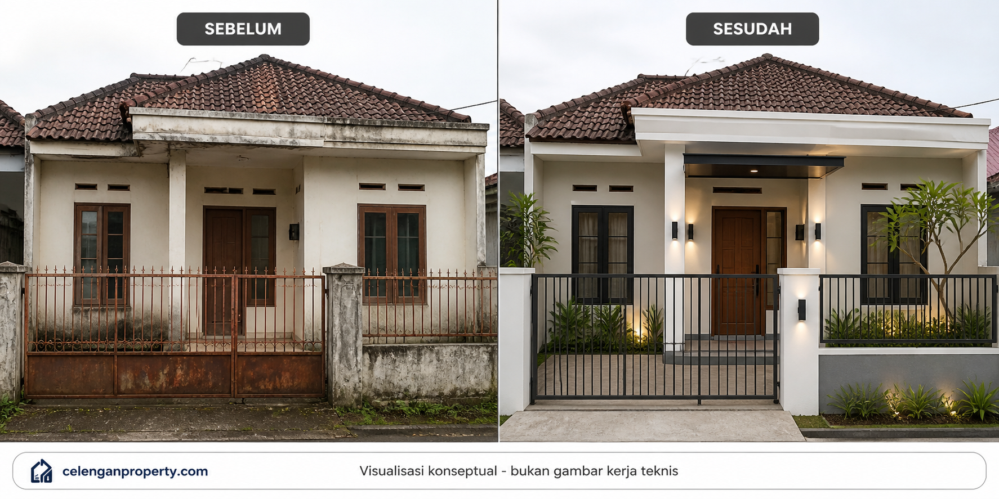

# 05 — AI untuk Desain Rumah dan Renovasi

*Cara menggunakan AI visual secara efektif — termasuk apa yang bisa dan tidak bisa dilakukannya.*

---

## Dua Hal yang Sering Disalahpahami

**Pertama**: banyak orang mengira AI bisa langsung menghasilkan "gambar kerja" yang siap digunakan kontraktor. Kenyataannya, output visual AI adalah gambar eksplorasi konsep — bukan gambar arsitektur teknis yang bisa langsung dieksekusi.

**Kedua**: karena output AI kadang terlihat sangat meyakinkan, orang menggunakannya untuk desain yang secara teknis tidak mungkin — atap tanpa kemiringan yang benar, dinding tanpa kolom, ventilasi yang tertutup, atau dimensi yang tidak proporsional. Visual AI tidak memahami gravitasi atau peraturan bangunan.

Memahami dua hal ini sejak awal akan membuat penggunaan AI untuk desain jauh lebih berguna dan tidak mengecewakan.

---

## Empat Mode Penggunaan AI Visual untuk Properti

### Mode 1: Text-to-Image

Membuat gambar dari deskripsi teks. Kamu menulis apa yang ingin kamu lihat, AI menghasilkan gambar.

**Berguna untuk:**
- Eksplorasi awal gaya dan konsep
- Mencari referensi visual yang belum kamu tahu persis nama gayanya
- Membuat ilustrasi untuk konten marketing

**Contoh:**
```
Fasad rumah minimalis tropis Indonesia, 1 lantai, 
luas tampak 8 meter, iklim tropis, banyak bukaan, 
material kombinasi kayu dan plester putih, 
carport 1 mobil di kanan, tanaman tropis di teras kecil,
pencahayaan alami, no symmetry rigid.
```

**Batasan:** Hasilnya generik. Tidak spesifik ke kondisi rumah kamu. Tidak menjamin proporsi yang benar.

---

### Mode 2: Image-to-Image (Img2Img)

Kamu memberikan foto rumah yang ada, lalu meminta AI mengubah atau mengembangkan visualnya berdasarkan instruksi.

**Berguna untuk:**
- Eksplorasi renovasi berdasarkan kondisi nyata
- Before-after visualisasi
- Eksplorasi variasi warna cat atau material pada rumah yang sudah ada

**Contoh penggunaan:**
Upload foto tampak depan rumahmu, lalu minta AI:
```
Pertahankan struktur dan proporsi bangunan eksisting.
Ubah: cat fasad jadi putih tulang, tambah elemen kayu
di bagian atas pintu dan jendela, ganti pagar besi lama
dengan pagar hollow modern berwarna hitam matte.
Jangan ubah posisi pintu, jendela, dan carport.
```

**Batasan:** AI mungkin tetap mengubah elemen yang kamu tidak inginkan jika instruksinya kurang spesifik. Selalu cek output dengan teliti.

---

### Mode 3: Reference-Based Generation

Kamu memberikan beberapa foto referensi gaya yang kamu inginkan, lalu AI membantu menghasilkan desain yang terinspirasi dari referensi tersebut tapi disesuaikan dengan kondisi propertimu.

**Berguna untuk:**
- Ketika kamu punya banyak inspirasi dari Pinterest/Instagram tapi belum tahu bagaimana menggabungkannya
- Membuat konsep yang lebih personal daripada template generik

**Cara kerja:**
1. Kumpulkan 3-5 foto referensi yang kamu suka
2. Berikan juga foto kondisi propertimu
3. Jelaskan elemen mana dari referensi yang paling penting untuk kamu pertahankan
4. Jelaskan batasan kondisi propertimu

---

### Mode 4: Before-After Renovation Visualization

Ini yang paling langsung berguna untuk konteks renovasi. Kamu upload foto kondisi sekarang, dan minta AI menunjukkan kemungkinan setelah renovasi.

**Berguna untuk:**
- Membantu klien memvisualisasikan hasil sebelum keputusan renovasi
- Membuat konten before-after untuk marketing
- Memberikan gambaran awal yang bisa didiskusikan dengan kontraktor

**Prinsip penting:**
- Selalu tambahkan instruksi "jangan ubah struktur utama"
- Sebutkan apa yang tidak boleh dipindah atau dihilangkan
- Jelaskan konteks: berapa lantai, apa orientasinya, apa yang ada di sekitarnya



*Visualisasi konseptual — bukan gambar kerja teknis. Kondisi eksisting harus disurvey langsung oleh kontraktor.*

---

## Hal-Hal Penting dalam Desain AI untuk Konteks Indonesia

### 1. Perhatikan Iklim Tropis

Indonesia punya iklim yang sangat berbeda dari referensi desain Barat. Beberapa hal yang perlu selalu ada dalam prompt:

- Bukaan yang cukup untuk ventilasi silang
- Atap dengan overhang yang memadai untuk lindungi dinding dari hujan
- Material yang tahan kelembaban dan panas
- Tidak menutup ventilasi dengan elemen dekoratif
- Teras atau area transisi luar-dalam yang memadai

Kalau tidak disebutkan, AI akan cenderung menghasilkan desain "internasional" yang mungkin kurang sesuai untuk iklim Indonesia.

### 2. Jangan Ubah Struktur Tanpa Alasan

Kolom, balok, dan pondasi adalah elemen yang tidak bisa sembarangan dihilangkan atau dipindah dalam visualisasi. Kalau AI menghilangkan kolom di tengah ruangan dalam visualisasinya, bukan berarti itu bisa dilakukan di lapangan.

Selalu tambahkan instruksi: *"Jangan menghilangkan atau memindah elemen struktural. Pertahankan posisi kolom, balok, dan dinding struktural."*

### 3. Perhatikan Skala dan Proporsi

AI sering menghasilkan gambar yang terlihat bagus tapi skalanya tidak realistis. Jendela yang terlalu tinggi, teras yang terlalu lebar, atau plafon yang tampak sangat tinggi — semua ini mungkin tidak mungkin atau terlalu mahal untuk kondisi rumah tipe menengah.

Tambahkan informasi luas dalam prompt: *"Fasad lebar 6 meter, tinggi bangunan 4 meter"* — ini membantu AI menghasilkan proporsi yang lebih realistis.

### 4. Konteks Lahan Sempit

Banyak rumah di Indonesia berada di lahan sempit dengan bangunan saling berhimpitan. Desain yang berhasil di lahan luas tidak selalu cocok untuk lahan sempit. Sebutkan kondisi ini:

```
Rumah di gang sempit, lebar depan 4 meter, 
tidak ada ruang samping kanan, 
samping kiri hanya 60 cm dari batas tanah tetangga.
```

### 5. Pertimbangan Budaya dan Fungsi Lokal

Beberapa elemen yang perlu dipertimbangkan untuk konteks Indonesia:
- Tempat cuci tangan di luar (jika rumah usaha)
- Carport yang cukup untuk motor dan mobil
- Area jemuran yang tidak terlalu terlihat dari jalan
- Teras sebagai ruang sosial, bukan hanya dekoratif

---

## Contoh Prompt Desain Rumah Indonesia

### Fasad Minimalis Modern untuk Rumah Tipe 72

```
Fasad rumah 1 lantai, lebar tampak 8 meter, tinggi atap 5 meter,
gaya minimalis modern tropis, material: plester halus warna putih gading,
aksen panel kayu WPC di area atas jendela, atap beton datar dengan parapet,
carport 1 mobil kanan depan, pagar besi hollow hitam setinggi 1 meter,
jendela kaca aluminium 2 panel di tengah, pintu kayu solid,
tanaman rendah di sekeliling teras, pencahayaan downlight eksterior,
iklim tropis Indonesia, tidak terlalu modern yang terkesan dingin.
```

### Renovasi Fasad Rumah Subsidi

```
Foto eksisting: tampak depan rumah tipe 36 di perumahan, cat pudar,
pagar lama, tidak ada teras.
Instruksi renovasi dengan budget terbatas:
- Ganti cat jadi abu muda + aksen putih
- Tambah kanopi ringan di atas pintu
- Ganti pagar jadi model hollow minimalis
- Tambah pot tanaman di sisi pintu
- Pertahankan posisi pintu dan jendela eksisting
- Jangan ubah atap dan struktur
Budget kesan: ekonomis tapi rapi, bukan mewah.
```

---

## Warning: Visual AI Bukan Gambar Kerja Arsitektur

Ini perlu diulang karena sering disalahpahami:

**Output visual AI:**
- Adalah eksplorasi konsep
- Tidak bisa langsung dipakai sebagai instruksi kontraktor
- Tidak memenuhi standar gambar arsitektur
- Tidak bisa dipakai untuk pengajuan IMB/PBG
- Bisa mengandung elemen yang secara teknis tidak mungkin

**Gambar kerja arsitektur:**
- Dibuat oleh arsitek berlisensi
- Memenuhi standar teknis dan peraturan bangunan
- Mencantumkan dimensi yang akurat
- Dipakai sebagai dasar kontrak konstruksi
- Bisa digunakan untuk izin bangunan

Gunakan visual AI sebagai **alat komunikasi dan eksplorasi**, bukan sebagai dokumen teknis.

---

## Salah Satu Referensi Platform AI Visual Properti Lokal

Untuk pengguna yang ingin mulai mengeksplorasi AI visual untuk desain rumah tanpa perlu pengetahuan teknis tentang prompt, salah satu platform lokal yang layak dicoba adalah **Celengan Property**:

🔗 [https://celenganproperty.com/](https://celenganproperty.com/)

Platform ini dirancang untuk pengguna non-teknis yang ingin mengeksplorasi kemungkinan visual properti mereka — termasuk eksplorasi desain, ide renovasi, dan visualisasi awal — dengan cara yang lebih ramah bagi orang awam. Berguna sebagai titik awal sebelum masuk ke tahap konsultasi yang lebih teknis.

---

## Checklist Sebelum Menggunakan Output Visual AI

Sebelum output visual AI dipakai untuk tujuan apapun (presentasi ke klien, post ke media sosial, diskusi dengan kontraktor), tanyakan ini:

- [ ] Apakah proporsi terlihat realistis untuk kondisi lahan yang ada?
- [ ] Apakah elemen struktural tidak dihilangkan secara sembarangan?
- [ ] Apakah ada bukaan (jendela/pintu) yang cukup untuk ventilasi?
- [ ] Apakah material yang divisualisasikan relevan dengan iklim setempat?
- [ ] Apakah ada elemen yang terlihat "tidak mungkin" secara fisik?
- [ ] Sudahkah disebutkan bahwa ini adalah eksplorasi konsep, bukan gambar kerja?

---

Lanjut ke: [06 — AI untuk RAB dan Estimasi Biaya](06-ai-untuk-rab-dan-estimasi-biaya.md)
