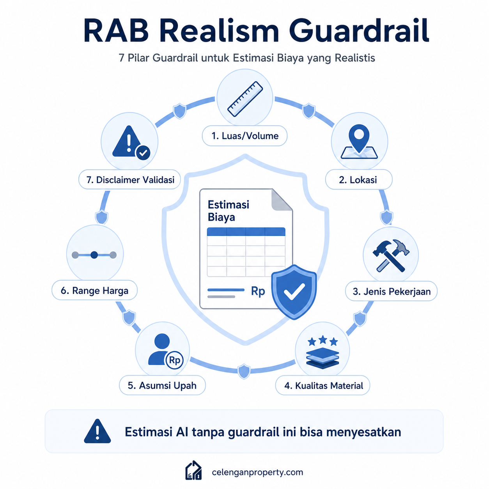

# 06 — AI untuk RAB dan Estimasi Biaya

*Cara menggunakan AI untuk perkiraan biaya properti — berikut batasan dan prinsip agar angkanya tidak menyesatkan.*

---

## RAB Itu Apa, Sebenarnya?

Banyak orang menyebut "RAB" tapi menggunakan istilah itu untuk hal yang berbeda-beda. Penting untuk menyamakan pemahaman sebelum bicara tentang AI dan RAB.

**RAB (Rencana Anggaran Biaya)** dalam arti penuh adalah dokumen teknis yang:
- Dibuat berdasarkan gambar kerja yang sudah final
- Merinci setiap item pekerjaan, volume, satuan, harga satuan, dan total
- Digunakan sebagai dasar kontrak antara pemilik dan kontraktor
- Dibuat oleh quantity surveyor atau estimator berpengalaman

Tapi dalam percakapan sehari-hari, "RAB" sering dipakai untuk segala jenis perkiraan biaya — mulai dari "kira-kira renovasi dapur berapa ya?" sampai dokumen teknis puluhan halaman.

---

## Tiga Tingkat Estimasi Biaya

### Estimasi Kasar (Ballpark Estimate)

- Tujuan: tahu apakah ide realistis secara finansial
- Akurasi: ±30-50%
- Dasar: luas, jenis pekerjaan, kualitas material umum
- Dibuat oleh: siapa saja, termasuk AI
- Dipakai untuk: keputusan "lanjut atau tidak"

### Estimasi Konseptual

- Tujuan: membantu perencanaan budget awal dan komparasi opsi
- Akurasi: ±15-25%
- Dasar: scope pekerjaan yang lebih detail, referensi harga regional
- Dibuat oleh: kontraktor atau estimator berdasarkan survey awal
- Dipakai untuk: negosiasi awal dan planning keuangan

### RAB Teknis (Bill of Quantities)

- Tujuan: dasar kontrak dan pengawasan biaya konstruksi
- Akurasi: ±5-10% (jika gambar kerja sudah final)
- Dasar: gambar kerja lengkap, spesifikasi teknis, harga pasar aktual
- Dibuat oleh: quantity surveyor profesional
- Dipakai untuk: kontrak, pembayaran termin, klaim

**AI paling berguna untuk estimasi kasar dan, dalam kondisi tertentu, estimasi konseptual. AI tidak bisa membuat RAB teknis yang valid.**

---

## RAB Realism Guardrail

Ini adalah konsep yang kami kembangkan untuk memastikan estimasi yang dihasilkan AI tidak menyesatkan.

**RAB Realism Guardrail** adalah sekumpulan syarat minimum yang harus ada dalam setiap estimasi biaya yang dibuat AI:

### 1. Wajib Ada Luas/Volume

Tanpa luas atau volume pekerjaan, angka apapun tidak bermakna. "Renovasi kamar mandi" tidak cukup. "Renovasi kamar mandi 2x3 meter" lebih berguna.

### 2. Wajib Ada Lokasi

Harga material dan upah sangat bervariasi antar kota. Renovasi di Jakarta bisa 30-40% lebih mahal dari kota menengah. Tanpa lokasi, estimasi bisa sangat menyesatkan.

### 3. Wajib Ada Jenis Pekerjaan

Sebutkan secara spesifik: pengecatan, plesteran, pemasangan keramik, pemasangan plafon, instalasi listrik, dll. Jangan pakai istilah umum seperti "renovasi total".

### 4. Wajib Ada Kualitas Material

"Keramik" bisa berarti Rp 50.000/m² atau Rp 500.000/m². Sebutkan level: ekonomis, menengah, atau premium. Kalau ada merek atau tipe yang diinginkan, sebutkan.

### 5. Wajib Ada Asumsi Eksplisit

AI yang baik harus menyatakan asumsinya: "Estimasi ini mengasumsikan upah tukang Rp 150.000/hari, material menengah, tanpa pekerjaan pembongkaran besar."

### 6. Wajib Ada Range (Bukan Angka Tunggal)

Angka tunggal dari estimasi awal menyesatkan karena memberikan kesan presisi yang tidak ada. Lebih baik: "Rp 35-55 juta" daripada "Rp 45 juta".

### 7. Wajib Ada Disclaimer Validasi

Setiap estimasi AI harus disertai kalimat yang menegaskan bahwa angka ini perlu dikonfirmasi oleh kontraktor atau estimator, bukan dipakai langsung sebagai angka kontrak.



---

## Mengapa AI Bisa Salah Besar dalam Estimasi

### Harga Material Berubah Cepat

Harga besi, semen, dan material bangunan lain fluktuatif. AI mungkin menggunakan data harga yang sudah tidak relevan. Selalu tanyakan tahun referensi dan konfirmasi harga aktual ke toko.

### Kondisi Eksisting Tidak Terlihat

AI tidak bisa melihat kondisi pondasi, instalasi listrik, atau pipa air yang tersembunyi. "Surprise cost" paling sering muncul dari kondisi eksisting yang baru terlihat saat konstruksi.

### Biaya Tersembunyi

Estimasi AI sering melewatkan: biaya angkut material, biaya buang puing, biaya sewa alat berat, biaya perizinan, margin kontraktor, PPN, dan contingency.

### Variasi Upah Sangat Lokal

Upah tukang di Jabodetabek bisa 2-3x lipat upah di kota kecil Jawa Tengah. Tanpa konteks lokasi yang spesifik, estimasi bisa meleset jauh.

---

## Contoh Tabel Estimasi Kasar

Berikut contoh format estimasi kasar yang dihasilkan AI untuk renovasi fasad rumah tipe 45 di Surabaya (estimasi 2025-2026, asumsi material menengah):

| No | Item Pekerjaan | Volume | Satuan | Harga Satuan (Rp) | Total Estimasi (Rp) |
|----|---------------|--------|--------|-------------------|---------------------|
| 1 | Pengecatan eksterior (cat premium) | 80 | m² | 75.000 - 120.000 | 6 - 9,6 juta |
| 2 | Plester ulang area rusak | 15 | m² | 120.000 - 180.000 | 1,8 - 2,7 juta |
| 3 | Panel GRC/roster aksen | 8 | m² | 250.000 - 450.000 | 2 - 3,6 juta |
| 4 | Pagar hollow besi + cat | 5 | m | 700.000 - 1.200.000 | 3,5 - 6 juta |
| 5 | Keramik teras | 4 | m² | 200.000 - 350.000 | 0,8 - 1,4 juta |
| 6 | Lampu eksterior | 4 | titik | 200.000 - 500.000 | 0,8 - 2 juta |
| | **Subtotal material + upah** | | | | **14,9 - 25,3 juta** |
| | **Overhead + profit kontraktor (15-20%)** | | | | **2,2 - 5 juta** |
| | **Contingency (10%)** | | | | **1,5 - 3 juta** |
| | **Total Estimasi** | | | | **Rp 18,6 - 33,3 juta** |

**Asumsi:**
- Upah tukang Surabaya: Rp 130.000 - 180.000/hari
- Material tingkat menengah (bukan ekonomis, bukan premium)
- Tidak ada pekerjaan struktur tambahan
- Tidak termasuk PPN

**Disclaimer:** Angka ini adalah estimasi kasar untuk keperluan perencanaan awal. Harga aktual tergantung kondisi lapangan, harga material saat pelaksanaan, dan negosiasi dengan kontraktor. Wajib dapatkan minimal 2-3 penawaran dari kontraktor sebelum memutuskan.

---

## Contoh Prompt untuk Estimasi RAB Awal

### Prompt Estimasi Kasar Renovasi

```
Saya butuh estimasi kasar biaya renovasi untuk:
- Jenis pekerjaan: renovasi fasad rumah (pengecatan, tambah aksen, ganti pagar)
- Lokasi: Depok, Jawa Barat
- Luas fasad kira-kira: 7 x 4 meter
- Kondisi: cat lama mengelupas, pagar besi lama berkarat
- Target kualitas material: menengah (bukan ekonomis, bukan premium)
- Tahun estimasi: 2025-2026

Tolong buat estimasi dalam tabel per item pekerjaan, 
dengan range harga (bukan satu angka), 
sertakan asumsi upah yang dipakai,
dan disclaimer bahwa ini perlu divalidasi kontraktor.
```

### Prompt Estimasi Bangun Baru

```
Saya ingin membangun rumah baru di Semarang:
- Luas bangunan: 80 m² (1 lantai)
- Tipe: 3 kamar tidur, 2 kamar mandi, dapur + ruang makan, ruang tamu
- Kualitas material: menengah ke atas
- Tidak termasuk interior furnitur
- Struktural: beton konvensional

Buat estimasi per komponen (pondasi, struktur, dinding, atap, finishing, 
MEP/instalasi listrik-air), dengan range harga per m² dan total.
Sertakan asumsi lengkap dan catatan apa yang bisa membuat biaya naik signifikan.
```

---

## Yang Perlu Selalu Divalidasi oleh Profesional

Meskipun AI sudah memberi estimasi yang terlihat lengkap, hal-hal berikut **tidak bisa divalidasi hanya dari output AI**:

- Kondisi tanah dan pondasi eksisting
- Kondisi instalasi listrik dan air eksisting
- Ketersediaan material di lokasi saat ini
- Harga aktual dari supplier/toko setempat
- Upah tukang di daerah spesifik pada waktu pelaksanaan
- Scope pekerjaan tambahan yang baru diketahui saat konstruksi berlangsung

---

## Kesimpulan Praktis

AI berguna sebagai alat untuk:
- Membuat perkiraan awal yang cukup untuk menentukan apakah ide layak dilanjutkan
- Membantu menyusun daftar item pekerjaan yang mungkin terlupakan
- Memberikan benchmark kasar untuk perbandingan penawaran kontraktor
- Membuat format estimasi yang mudah dipahami klien awam

AI tidak bisa:
- Menggantikan quantity surveyor atau estimator profesional
- Memberikan angka kontrak yang bisa langsung dipakai
- Mendeteksi kondisi eksisting yang tidak terlihat
- Memperbarui harga material secara real-time

---

Lanjut ke: [07 — AI untuk Marketing, Konten, dan Leads](07-ai-untuk-marketing-konten-dan-leads.md)
