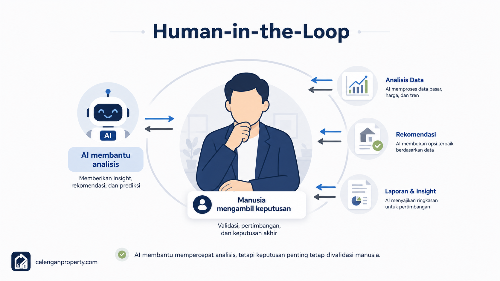

# 10 — Batasan, Risiko, dan Validasi Manusia

*Bagian ini penting — dan bukan sekadar formalitas disclaimer.*

---

## Kenapa Ini Perlu Dibahas Serius

Banyak tutorial AI (termasuk di properti) mengakhiri konten dengan disclaimer satu kalimat di bagian bawah halaman yang tidak ada yang baca. Kami memilih untuk menempatkan pembahasan ini sebagai dokumen tersendiri karena ini bukan tambahan — ini adalah bagian inti dari cara menggunakan AI dengan bertanggung jawab.

Kalau kamu hanya membaca satu dokumen dari repository ini, baca ini.

---

## Risiko Penggunaan AI di Properti

### 1. Halusinasi Desain

AI bisa menghasilkan visual yang terlihat sangat meyakinkan tapi secara teknis tidak mungkin atau tidak aman:

- Dinding tanpa kolom penopang
- Atap dengan kemiringan yang salah untuk iklim hujan Indonesia
- Jendela yang menutup jalur ventilasi yang ada
- Tangga dengan sudut kemiringan yang tidak aman
- Bukaan yang tidak proporsional dengan kondisi sebenarnya

**Masalah:** Kalau ini disampaikan ke klien sebagai "desain AI yang siap dieksekusi", ekspektasi yang terbentuk bisa bermasalah — dan kontraktor yang diminta mengerjakan "persis seperti di gambar" akan kebingungan.

**Solusi:** Selalu sampaikan bahwa visual AI adalah eksplorasi konsep, bukan gambar kerja. Setiap detail teknis harus diverifikasi arsitek.

---

### 2. Estimasi Biaya yang Tidak Akurat

AI bisa memberikan estimasi yang terasa meyakinkan karena formatnya terlihat profesional (tabel, rincian per item, angka yang presisi) — tapi tidak mencerminkan kondisi aktual:

- Harga material yang sudah tidak update
- Tidak memperhitungkan biaya survey, mobilisasi, dan buang puing
- Mengabaikan kondisi eksisting yang baru terlihat saat konstruksi
- Tidak mempertimbangkan variasi upah antar daerah
- Tidak memasukkan margin kontraktor, PPN, dan contingency

**Contoh nyata:** AI mungkin mengestimasi renovasi kamar mandi Rp 8-12 juta, tapi setelah survey lapangan ternyata ada kebocoran pipa yang perlu dibongkar dulu, biaya jadi Rp 20-28 juta.

**Solusi:** Gunakan estimasi AI hanya sebagai titik awal diskusi, bukan angka kontrak. Selalu konfirmasi ke kontraktor yang sudah survey lapangan.

---

### 3. Salah Memahami Foto

AI yang memproses foto properti bisa salah interpretasi:

- Mengira bayangan sebagai kerusakan atau sebaliknya
- Tidak bisa mendeteksi kondisi tersembunyi (retak rambut di balik cat, kelembaban di dinding, kondisi plafon)
- Salah menilai material karena foto kurang jelas
- Tidak bisa menilai kondisi pondasi, rangka atap, atau instalasi tersembunyi

**Masalah:** Analisis AI berdasarkan foto bisa memberikan gambaran yang terlalu optimis tentang kondisi properti.

**Solusi:** Foto hanyalah titik awal. Kondisi nyata hanya bisa diketahui dari inspeksi fisik langsung.

---

### 4. Konteks Lokasi yang Tidak Sesuai

AI umum tidak selalu punya pengetahuan mendalam tentang:

- Regulasi bangunan daerah (RDTR, KDB, KLB)
- Kondisi tanah setempat (rawa, tanah lunak, lereng)
- Ketersediaan material di daerah tertentu
- Harga tukang di kabupaten kecil vs. kota besar
- Kondisi infrastruktur (PLN, PDAM, jalur akses) yang mempengaruhi biaya

**Solusi:** Selalu berikan konteks lokasi yang spesifik dalam prompt, dan validasi asumsi lokalnya dengan profesional setempat.

---

### 5. Legalitas Tidak Otomatis Terjawab

AI tidak bisa memberikan:

- Status legalitas tanah dan bangunan
- Kelayakan untuk pengajuan IMB/PBG
- Kesesuaian dengan aturan zonasi setempat
- Analisis sengketa tanah atau masalah sertifikat
- Proses PPJB/AJB yang valid secara hukum
- Kewajiban pajak dalam jual-beli properti

**Masalah:** Orang yang awam bisa mengira AI sudah menjawab semua pertanyaan mereka, termasuk soal legalitas.

**Solusi:** Untuk semua pertanyaan legalitas, selalu libatkan notaris, PPAT, atau pengacara properti yang berlisensi.

---

### 6. Konten yang Tidak Akurat

AI dalam membuat konten marketing bisa:

- Mengklaim fakta tentang properti yang tidak akurat
- Membuat janji atau klaim yang tidak bisa diverifikasi
- Mendeskripsikan fasilitas atau spesifikasi yang salah
- Menggunakan istilah legal yang tidak tepat

**Masalah:** Konten properti yang tidak akurat bisa berujung masalah hukum, terutama dalam jual-beli.

**Solusi:** Review semua konten yang dihasilkan AI sebelum dipublikasi. Pastikan semua data faktual (luas, harga, fasilitas, status legalitas) sudah diverifikasi.

---

## Checklist Validasi Manusia

Ini adalah checklist yang perlu dilewati sebelum keputusan nyata diambil berdasarkan output AI.

### Validasi Desain dan Renovasi

- [ ] **Struktur:** Ada kolom, balok, dan dinding yang memadai? Tidak ada elemen struktural yang dihilangkan dalam desain?
- [ ] **Pondasi:** Kondisi pondasi eksisting sudah dicek fisik, terutama kalau ada penambahan beban?
- [ ] **Drainase:** Kemiringan lantai dan arah aliran air sudah benar, terutama di area basah?
- [ ] **Pencahayaan alami:** Masuknya cahaya cukup, tidak ada ruangan yang gelap total tanpa solusi pencahayaan?
- [ ] **Ventilasi:** Ada bukaan yang cukup untuk sirkulasi udara, terutama di iklim tropis?
- [ ] **Akses:** Akses untuk material saat konstruksi, dan akses harian setelah selesai?
- [ ] **Keamanan:** Tidak ada tangga, bordes, atau area yang berbahaya secara fisik?

### Validasi Biaya dan Kontrak

- [ ] **Survey lapangan:** Kontraktor atau estimator sudah survey fisik sebelum memberikan angka?
- [ ] **Kondisi tersembunyi:** Ada pemeriksaan kondisi pipa, listrik, atau elemen tersembunyi lain?
- [ ] **Harga material aktual:** Harga dikonfirmasi ke toko atau supplier setempat, bukan hanya estimasi AI?
- [ ] **Upah tukang:** Upah sesuai kondisi daerah dan waktu pelaksanaan?
- [ ] **Scope pekerjaan:** Sudah ada daftar pekerjaan yang jelas dan disepakati semua pihak?
- [ ] **Contingency:** Ada alokasi untuk biaya tak terduga (minimal 10-15%)?

### Validasi Legalitas

- [ ] **IMB/PBG:** Perizinan bangunan sudah dicek, atau sudah ada rencana untuk mengurusnya?
- [ ] **Sertifikat tanah:** Status sertifikat sudah diverifikasi (SHM, HGB, atau lainnya)?
- [ ] **PPJB/AJB:** Untuk jual-beli, semua dokumen sudah dibuat di hadapan notaris/PPAT?
- [ ] **Zonasi:** Peruntukan lahan sesuai dengan yang akan dibangun?
- [ ] **Pajak:** Kewajiban BPHTB, PPh, atau PBB sudah diperhitungkan?

### Validasi Konten

- [ ] **Data akurat:** Semua angka (luas, harga, spesifikasi) sudah diverifikasi?
- [ ] **Klaim terukur:** Tidak ada klaim yang tidak bisa dibuktikan ("terbaik", "paling strategis")?
- [ ] **Foto sesuai:** Foto yang dipakai sesuai dengan kondisi aktual properti yang dipasarkan?
- [ ] **Informasi kontak:** Data kontak sudah benar dan bisa dihubungi?

---

## Prinsip Human-in-the-Loop

**Human-in-the-loop** adalah konsep bahwa manusia harus tetap terlibat sebagai pengambil keputusan dalam setiap tahap yang penting — AI hanya membantu memproses informasi dan menyajikan opsi.

Untuk properti, ini artinya:

**AI boleh:**
- Membantu eksplorasi opsi desain
- Menyusun estimasi kasar sebagai titik awal
- Membuat konten untuk dikurasi
- Mempercepat penyusunan brief

**Manusia wajib:**
- Validasi kondisi fisik properti
- Konfirmasi angka biaya sebelum jadi kontrak
- Verifikasi akurasi semua konten sebelum dipublikasi
- Membuat keputusan akhir berdasarkan semua informasi yang ada
- Bertanggung jawab atas konsekuensi keputusan tersebut

---

## Tabel: Siapa yang Perlu Dilibatkan untuk Apa

| Kebutuhan | Profesional yang Harus Dilibatkan |
|-----------|----------------------------------|
| Desain bangunan yang akan dikonstruksi | Arsitek berlisensi |
| Perhitungan struktur | Insinyur sipil/struktural |
| Estimasi biaya untuk kontrak | Quantity surveyor atau kontraktor dengan survey |
| Instalasi listrik | Teknisi listrik berlisensi |
| Instalasi air dan sanitasi | Tukang pipa berpengalaman atau kontraktor MEP |
| Legalitas tanah dan bangunan | Notaris, PPAT, atau pengacara properti |
| Pengajuan izin bangunan | Arsitek atau konsultan perizinan |
| Penilaian nilai properti | Penilai properti (KJPP) |

---

## Kesimpulan: AI sebagai Mitra, Bukan Pengganti

AI yang digunakan dengan bijak bisa benar-benar membantu mempercepat dan memperbaiki proses properti — dari eksplorasi ide sampai komunikasi dengan klien.

Tapi AI yang digunakan tanpa pemahaman batasan dan validasi yang tepat bisa menjadi sumber masalah yang mahal:
- Proyek yang melebihi budget karena berdasarkan estimasi AI yang tidak akurat
- Desain yang tidak bisa dieksekusi karena dianggap gambar kerja
- Konten yang bermasalah secara hukum karena informasi yang tidak akurat
- Keputusan legalitas yang keliru karena tidak melibatkan ahli hukum

Gunakan AI untuk memperluas kemampuan kamu — bukan untuk menggantikan penilaian dan tanggung jawab profesional.

---

Lanjut ke: [11 — Roadmap Belajar AI Properti 30 Hari](11-roadmap-belajar-ai-properti.md)
